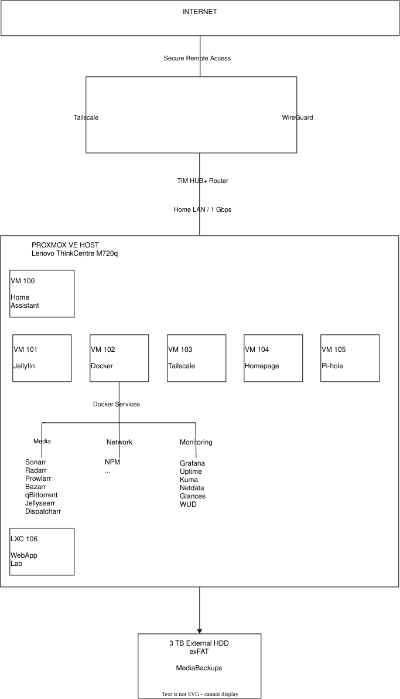
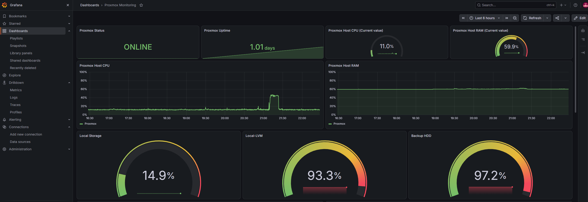
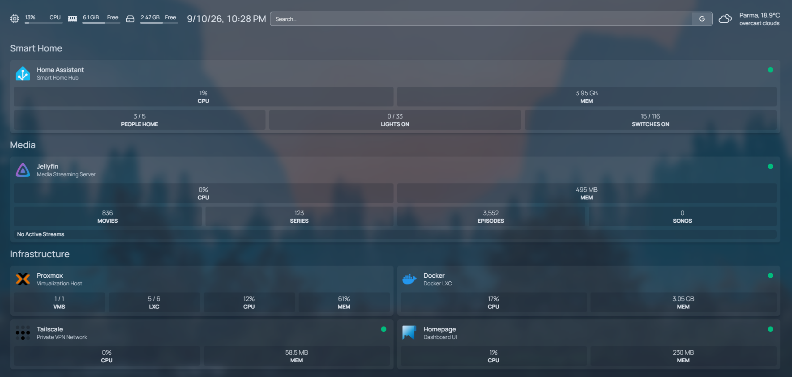
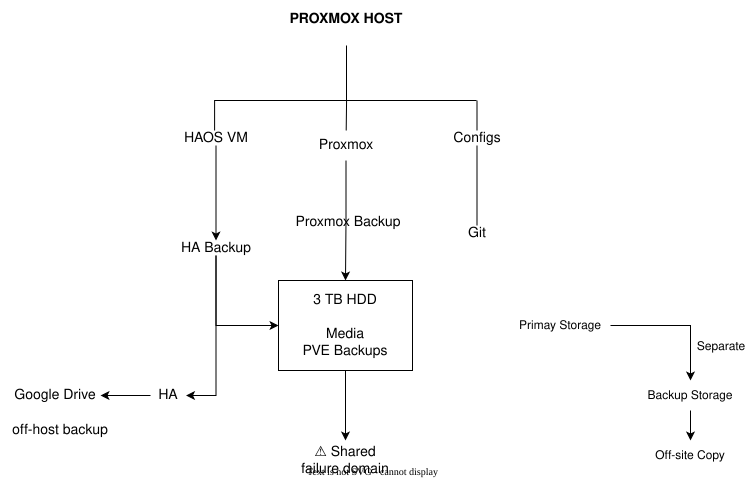

# HomeLab

> A self-hosted infrastructure project built around Proxmox VE, combining virtualization, smart-home automation, media services, secure remote access, monitoring, cybersecurity, backup and a dedicated lab environment.



---

## Overview

This repository documents the design, deployment, operation, and continuous improvement of my personal HomeLab.

The environment started as a small self-hosted server and evolved into a structured infrastructure platform used to practice:

- Virtualization
- Linux administration
- Containerization
- Networking
- Cybersecurity
- Smart-home automation
- Media services
- Monitoring and observability
- Backup and disaster recovery
- Infrastructure troubleshooting
- Application and security testing

The objective is not simply to host applications.

The project is designed as a practical learning environment where infrastructure can be **built, broken, monitored, recovered, secured, and improved**.

---

# Infrastructure at a Glance

## Hardware

| Component | Specification |
|---|---|
| Main Host | Lenovo ThinkCentre M720q Tiny |
| CPU | Intel Core i5-8500T — 6 cores / 6 threads |
| Integrated GPU | Intel UHD Graphics 630 |
| RAM | 16 GB DDR4 |
| System Storage | 256 GB NVMe SSD |
| Media / Backup Storage | 3 TB Seagate HDD |
| HDD Enclosure | ICY BOX IB-377U3 USB 3.0 |
| Main Router | TIM HUB+ |
| Zigbee Coordinator | SONOFF Zigbee 3.0 USB Dongle Plus |
| Smart Home Bridge | Philips Hue Bridge 2.0 |

---

# Virtualization

The Lenovo ThinkCentre runs **Proxmox VE** as the main virtualization layer.

Major workloads are deliberately separated based on their requirements.

| ID | Workload | Type | Purpose |
|---:|---|---|---|
| 100 | Home Assistant OS | VM | Smart-home automation |
| 101 | Jellyfin | LXC | Media streaming |
| 102 | Docker | LXC | Containerized application platform |
| 103 | Tailscale | LXC | Secure remote access |
| 104 | Homepage | LXC | Central service dashboard |
| 105 | Pi-hole | LXC | DNS filtering |
| 106 | WebApp | LXC | Development and security lab |

This design allows services to have independent:

- Resources
- Update cycles
- Recovery procedures
- Security boundaries
- Storage access
- Failure domains

---

# Service Stack

## Smart Home

**Home Assistant OS** runs as a dedicated VM and provides:

- Smart-device integration
- Zigbee
- Automations
- Presence detection
- ESP32 Bluetooth proxies
- Bermuda room-level presence
- Interactive 3D floor-plan dashboard
- Google Drive backups


---

## Media Server

**Jellyfin** runs inside a dedicated LXC container.

The deployment includes:

- External shared media storage
- Intel GPU passthrough
- VA-API hardware acceleration
- H.264 / HEVC / VP9 hardware decoding
- VPN-based remote access
- Separate application and media storage


---

## Media Automation

The Docker LXC hosts the automated media-management stack.

Core services include:

| Service | Role |
|---|---|
| Jellyseerr | Media requests |
| Sonarr | TV automation |
| Radarr | Movie automation |
| Prowlarr | Indexer management |
| qBittorrent | Download client |
| Bazarr | Subtitle automation |
| Dispatcharr | IPTV / live TV management |


---

# Docker Infrastructure

Docker runs inside a dedicated Proxmox LXC.

Additional services include:

### Networking

- Nginx Proxy Manager
- Speedtest Tracker

### Monitoring

- Prometheus
- Grafana
- Uptime Kuma
- Netdata
- Glances

### Maintenance

- What's Up Docker

Running Docker inside LXC required nested-container support:

```text
features: nesting=1,keyctl=1
lxc.apparmor.profile: unconfined
```

This configuration works well for the current environment, but the reduced AppArmor confinement is documented as a deliberate security trade-off.

More details:

[Docker & Media Stack](docs/docker-media-stack.md)

---

# Networking

The current HomeLab primarily operates on:

```text
192.168.1.0/24
```

Internet-facing administrative ports are intentionally avoided.

Remote access is provided using:

- **Tailscale**
- **WireGuard**

The current network remains primarily flat, while VLAN-based segmentation is planned.


The target security zones are:

```text
Management
Services
IoT
Lab
Guest
```

with inter-VLAN firewall rules controlling communication between them.

More details:

[Networking](docs/networking.md)

---

# Cybersecurity

Security is treated as an architectural requirement rather than an additional application.

Current controls include:

- VPN-based remote administration
- No intentional public exposure of management interfaces
- VM / LXC workload separation
- Unprivileged containers where appropriate
- API-token authentication
- Authenticated Samba access
- SMB1 disabled
- Pi-hole DNS filtering
- Private administration interfaces
- Backup and snapshot procedures
- Secrets excluded from public configuration
- Dedicated experimental lab workload


The current environment intentionally documents its limitations.

Most importantly:

> Virtualization isolation does not replace network segmentation.

The current flat LAN therefore remains one of the major areas planned for improvement.

More details:

[Cybersecurity Design](docs/cybersecurity.md)

---

# Monitoring & Observability

Monitoring is implemented as multiple complementary layers rather than relying on a single tool.




| Tool | Purpose |
|---|---|
| Prometheus | Time-series metrics |
| Grafana | Dashboards and historical analysis |
| Uptime Kuma | Availability monitoring |
| Netdata | Detailed real-time telemetry |
| Glances | Lightweight host monitoring |
| What's Up Docker | Container update visibility |
| Speedtest Tracker | WAN performance history |
| Homepage | Central operational dashboard |

This allows different questions to be answered independently:

```text
Is the service available?
        ↓
Uptime Kuma

Why is the host slow?
        ↓
Netdata / Glances

What changed over time?
        ↓
Prometheus + Grafana

Are containers outdated?
        ↓
What's Up Docker
```

More details:

[Monitoring & Observability](docs/monitoring.md)

---

# Dashboard

**Homepage** acts as the central operational entry point for the HomeLab.



The dashboard groups services into areas such as:

```text
Smart Home
Media
Infrastructure
Downloads
Network
Monitoring
Maintenance
```

It provides quick access to the environment while monitoring platforms remain responsible for detailed telemetry.

---

# Storage

The HomeLab currently uses a 3 TB external HDD mounted on the Proxmox host at:

```text
/mnt/media
```

The storage contains:

```text
/mnt/media
├── movies
├── tv
└── proxmox-backups
```

The disk is also exposed to Windows clients through Samba.

Jellyfin receives access through an LXC bind mount.

```text
External HDD
      │
      ▼
Proxmox
/mnt/media
      │
      ├── Jellyfin LXC
      ├── Docker Media Stack
      └── Samba
```

The current use of the same physical disk for media and infrastructure backups is a known resilience limitation.

---

# Backup & Recovery

The environment uses multiple recovery mechanisms:

- Proxmox snapshots
- Proxmox VM/LXC backups
- Home Assistant application backups
- Home Assistant Google Drive backups
- Version-controlled configuration
- Documented recovery procedures



A major storage incident during the project resulted in practical experience with:

- TestDisk
- R-Studio
- PhotoRec
- Filesystem investigation
- Raw file carving
- Media-library reconstruction
- `/etc/fstab` recovery
- Safe external-storage mounting

One of the main lessons from the incident was:

> A backup must not share every failure domain with the data it protects.

More details:

[Backup & Recovery](docs/backup-recovery.md)

---

# Lab Environment

A dedicated unprivileged LXC is used for:

- Web application development
- API testing
- Linux experimentation
- Deployment testing
- Reverse-proxy testing
- Security experiments
- Application-security learning


The current WebApp environment still shares the main LAN.

The target architecture moves lab workloads into a dedicated VLAN with restricted access to trusted infrastructure.

This distinction is deliberately documented:

```text
Compute Isolation
       ≠
Network Isolation
```

More details:

[Lab Environment](docs/lab-environment.md)

---

# Repository Structure

```text
HomeLab/
│
├── README.md
│
├── docs/
│   ├── architecture.md
│   ├── networking.md
│   ├── monitoring.md
│   ├── cybersecurity.md
│   ├── backup-recovery.md
│   ├── docker-media-stack.md
│   ├── home-assistant.md
│   ├── jellyfin.md
│   ├── lab-environment.md
│   └── lessons-learned.md
│
├── diagrams/
│   ├── source/
│   │   └── *.drawio
│   │
│   └── exported/
│       └── *.svg
│
└── media/
    └── screenshots/
```

---

# Documentation

Detailed technical documentation is separated by topic.

| Documentation | Description |
|---|---|
| [Architecture](docs/architecture.md) | Overall infrastructure and virtualization design |
| [Networking](docs/networking.md) | LAN, DNS, VPN, reverse proxy, and segmentation |
| [Monitoring](docs/monitoring.md) | Prometheus, Grafana, Uptime Kuma, Netdata, and observability |
| [Cybersecurity](docs/cybersecurity.md) | Threat model, trust boundaries, security controls, and roadmap |
| [Backup & Recovery](docs/backup-recovery.md) | Snapshots, backups, storage incidents, and disaster recovery |
| [Docker & Media Stack](docs/docker-media-stack.md) | Docker architecture and media automation |
| [Home Assistant](docs/home-assistant.md) | Smart-home platform, Zigbee, presence, and 3D dashboard |
| [Jellyfin](docs/jellyfin.md) | Media server, storage, GPU passthrough, and transcoding |
| [Lab Environment](docs/lab-environment.md) | Development and security-testing environment |
| [Lessons Learned](docs/lessons-learned.md) | Engineering decisions, incidents, and lessons from operating the lab |

---

# Architecture Principles

Several principles guide the evolution of the environment.

### Keep Management Private

Administrative services should not be exposed directly to the public Internet unless there is a specific requirement.

### Separate Responsibilities

Each service should have a clearly defined purpose.

```text
Jellyfin ≠ File Server
Pi-hole ≠ Firewall
Homepage ≠ Monitoring Platform
Reverse Proxy ≠ Network Security
```

### Match Isolation to Risk

```text
Normal Linux Service
        ↓
       LXC

Sensitive Appliance
        ↓
        VM

Higher-Risk Testing
        ↓
Isolated VM / Lab Network
```

### Local First

Smart-home and infrastructure services should operate locally whenever practical.

### Recovery Is Part of Infrastructure

Deployment is incomplete without a recovery strategy.

### Document Reality

Implemented and planned architecture are documented separately.

---

# Selected Lessons Learned

Operating the HomeLab has produced several practical lessons:

- Virtualization does not automatically provide network segmentation.
- Snapshots are not backups.
- Backups need independent failure domains.
- Docker inside LXC introduces compatibility/security trade-offs.
- External storage should not prevent the hypervisor from booting.
- Disk modification should follow a read-only-first workflow.
- Shared media paths must be designed consistently.
- Monitoring and security monitoring are different disciplines.
- Update awareness can be preferable to blind automatic updates.
- Remote-access VPNs and outbound privacy VPNs solve different problems.
- Documentation becomes part of the infrastructure as systems grow.

The full retrospective is available in:

[Lessons Learned](docs/lessons-learned.md)

---

# Current Limitations

This project intentionally documents areas that are not yet complete.

Current limitations include:

- Primarily flat LAN
- No production VLAN segmentation yet
- Single Proxmox host
- Media and backups sharing one physical HDD
- Docker inside LXC with relaxed AppArmor
- exFAT storage with permissive filesystem semantics
- No SIEM deployment yet
- No IDS/IPS deployment yet
- Limited centralized security logging
- Experimental workloads currently sharing the primary LAN

These are part of the roadmap rather than being hidden from the project documentation.

---

# Roadmap

Future improvements include:

### Networking & Security

- Management VLAN
- Services VLAN
- IoT VLAN
- Lab VLAN
- Guest VLAN
- Inter-VLAN firewall rules
- Stronger management-network restrictions

### Detection

- Wazuh
- Suricata
- Centralized logging
- Security dashboards
- Authentication monitoring

### Backup & Storage

- Independent backup disk
- Proxmox Backup Server
- Automated restore testing
- Off-site encrypted backups
- Storage-health alerting

### Automation

- Ansible
- Infrastructure-as-Code
- Configuration templates
- Secret management
- Automated compliance checks

### Lab

- Dedicated isolated test network
- Separate attacker and target machines
- OWASP testing environments
- Vulnerability scanning
- CI/CD experimentation

---

# Skills Demonstrated

This project provides practical experience with:

```text
Proxmox VE
Linux Administration
Virtual Machines
LXC Containers
Docker
Docker Compose
Home Assistant
Zigbee
ESP32
Jellyfin
Intel VA-API
Linux Storage
Samba
Networking
DNS
Pi-hole
VPNs
Tailscale
WireGuard
Reverse Proxies
Prometheus
Grafana
Uptime Monitoring
Backup & Recovery
Threat Modeling
Application Security
Troubleshooting
Technical Documentation
```

---

# Why This Project Matters

The HomeLab is intentionally documented as more than a collection of self-hosted applications.

It demonstrates the complete infrastructure lifecycle:

```text
Design
   ↓
Deploy
   ↓
Integrate
   ↓
Secure
   ↓
Monitor
   ↓
Break
   ↓
Troubleshoot
   ↓
Recover
   ↓
Document
   ↓
Improve
```

The project provides a practical environment for understanding how individual technologies interact as part of a complete system.

---

# Status

The HomeLab is actively evolving.

Current focus areas are:

```text
Network Segmentation
Security Monitoring
Backup Resilience
Infrastructure Automation
Smart-Home Development
Lab Expansion
```

Detailed implementation decisions and current limitations are documented throughout the repository.
